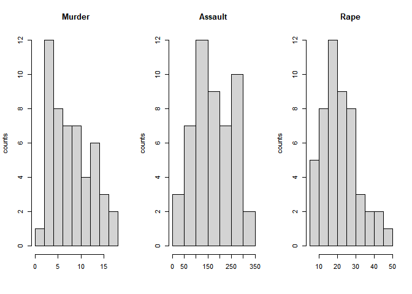
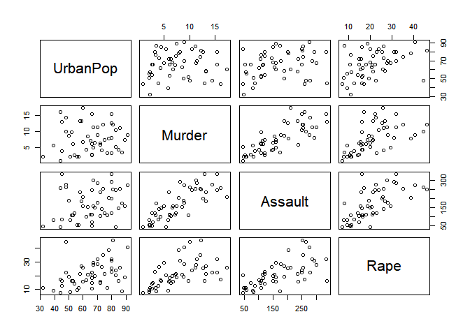
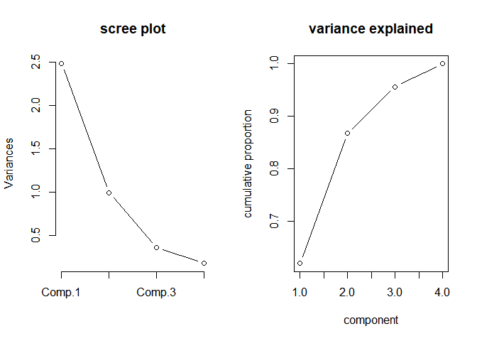
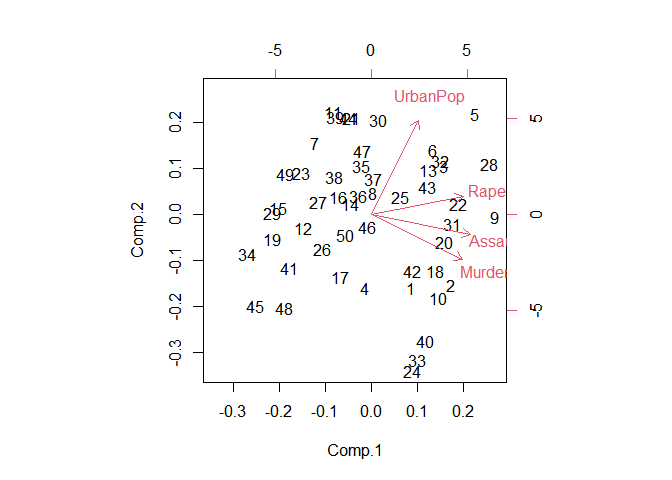

1973년 미국 강력범죄에 대한 주성분 분석
================
이채원
2023-12-20

------------------------------------------------------------------------

#### **0. 데이터 및 분석 개요**

- 1973년 미국 각 주별 강력 범죄 분석
- 1973년 미국 각 주 강력범죄 데이터  
- 변수 Murder, Assault, Rape는 인구 100,000명당 사고 건 수  
- 변수 UrbanPop은 도시인구 비율  
  <br/>

#### **1. 데이터 불러오기**

``` r
uscrime <- read.csv('https://raw.githubusercontent.com/ChaiwonLee/chai_pjt/main/2023/uscrime(%EB%AF%B8%EA%B5%AD%20%EA%B0%81%20%EC%A3%BC%EB%B3%84%20%EA%B0%95%EB%A0%A5%20%EB%B2%94%EC%A3%84%20%EB%B6%84%EC%84%9D_%EC%A3%BC%EC%84%B1%EB%B6%84%EB%B6%84%EC%84%9D)/uscrime.csv?token=GHSAT0AAAAAACLY6AY2ZOYT37YH2MLD6XSKZMCZBKQ',fileEncoding = "utf-8")
```

<br/>

#### **2. 데이터 확인하기**

``` r
head(uscrime)
```

    ##        state Murder Assault UrbanPop Rape
    ## 1    Alabama   13.2     236       58 21.2
    ## 2     Alaska   10.0     263       48 44.5
    ## 3    Arizona    8.1     294       80 31.0
    ## 4   Arkansas    8.8     190       50 19.5
    ## 5 California    9.0     276       91 40.6
    ## 6   Colorado    7.9     204       78 38.7

- Alabama주의 경우 인구 100,000명당 13.2건의 살인사건(Murder) 발생,
  236건의 폭행사건(Assault) 발생, 21.2건의 강간사건(Rape) 발생
- 각 주별로 데이터를 통해 위와 같이 확인할 수 있음  
  <br/>

#### **3. 데이터 구조 살펴보기**

``` r
str(uscrime)
```

    ## 'data.frame':    50 obs. of  5 variables:
    ##  $ state   : chr  "Alabama" "Alaska" "Arizona" "Arkansas" ...
    ##  $ Murder  : num  13.2 10 8.1 8.8 9 7.9 3.3 5.9 15.4 17.4 ...
    ##  $ Assault : int  236 263 294 190 276 204 110 238 335 211 ...
    ##  $ UrbanPop: int  58 48 80 50 91 78 77 72 80 60 ...
    ##  $ Rape    : num  21.2 44.5 31 19.5 40.6 38.7 11.1 15.8 31.9 25.8 ...

- 주 이름(state)는 문자형, 나머지(Murder, Assault, Rape, UrbanPop)는
  정수, 실수형이므로 별도의 변수 가공이 필요하지 않음  
  <br/>

#### **4. 분석 전 가독성이 좋게 하기 위해 열 위치를 바꿈**

- 도시인구비율(UrbanPop)이 주 이름(state)다음으로 오게 함

``` r
uscrime <- uscrime[,c(1,4,2,3,5)]
head(uscrime)
```

    ##        state UrbanPop Murder Assault Rape
    ## 1    Alabama       58   13.2     236 21.2
    ## 2     Alaska       48   10.0     263 44.5
    ## 3    Arizona       80    8.1     294 31.0
    ## 4   Arkansas       50    8.8     190 19.5
    ## 5 California       91    9.0     276 40.6
    ## 6   Colorado       78    7.9     204 38.7

<br/>

#### **5. 요약통계량**

``` r
summary(uscrime)
```

    ##     state              UrbanPop         Murder          Assault     
    ##  Length:50          Min.   :32.00   Min.   : 0.800   Min.   : 45.0  
    ##  Class :character   1st Qu.:54.50   1st Qu.: 4.075   1st Qu.:109.0  
    ##  Mode  :character   Median :66.00   Median : 7.250   Median :159.0  
    ##                     Mean   :65.54   Mean   : 7.788   Mean   :170.8  
    ##                     3rd Qu.:77.75   3rd Qu.:11.250   3rd Qu.:249.0  
    ##                     Max.   :91.00   Max.   :17.400   Max.   :337.0  
    ##       Rape      
    ##  Min.   : 7.30  
    ##  1st Qu.:15.07  
    ##  Median :20.10  
    ##  Mean   :21.23  
    ##  3rd Qu.:26.18  
    ##  Max.   :46.00

- 결측치가 존재하지 않으므로 그대로 분석을 진행함  
  <br/>

#### **6. 각 주별, 각 강력범죄 별 가장 적은/가장 많은 값들을 찾기**

#### **6-1. 도시인구 비율이 가장 큰 주/작은 주의 각 강력범죄 사고 건 수**

``` r
uscrime[which.max(uscrime$UrbanPop),] 
```

    ##        state UrbanPop Murder Assault Rape
    ## 5 California       91      9     276 40.6

``` r
uscrime[which.min(uscrime$UrbanPop),] 
```

    ##      state UrbanPop Murder Assault Rape
    ## 45 Vermont       32    2.2      48 11.2

- ***도시인구비율(UrbanPop)이 가장 큰 주(state)는 91%인 California***  
- California의 경우 인구 100,000명 살인사건(Murder)은 9건,
  폭행사건(Assault)은 276건, 강간사건(Rape)은 40.6건  
  <br/>
- ***도시인구비율(UrbanPop)이 가장 작은 주(state)는 32%인 Vermont***  
- Vermont의 경우 인구 100,000명 당 살인사건(Murder)은 2.2건,
  폭행사건(Assault)은 48건, 강간사건(Rape)은 11.2건  
  <br/>

#### **6-2. 인구 100,000명 당 살인사건(Murder) 수가 많은/적은 주**

``` r
uscrime[which.max(uscrime$Murder),] 
```

    ##      state UrbanPop Murder Assault Rape
    ## 10 Georgia       60   17.4     211 25.8

``` r
uscrime[which.min(uscrime$Murder),] 
```

    ##           state UrbanPop Murder Assault Rape
    ## 34 North Dakota       44    0.8      45  7.3

- 인구 100,000명 당 ***살인사건(Murder)*** 수가 ***많은 주***
  ***Georgia***
- Georgia의 도시인구비율(UrbanPop)은 60%
- Georgia의 경우 인구 100,000명 당 살인사건(Murder)은 17.4건,
  폭행사건(Assault)은 211건, 강간사건(Rape)은 25.8건  
  <br/>
- 인구 100,000명 당 ***살인사건(Murder)*** 수가 ***적은 주*** ***North
  Dakota***
- North Dakota의 도시인구비율(UrbanPop)은 44%
- North Dakota 의 경우 인구 100,000명 당 살인사건(Murder)은 0.8건,
  폭행사건(Assault)은 45건, 강간사건(Rape)은 7.3건  
  <br/>

#### **6-3. 인구 100,000명 당 폭행사건(Assault) 수가 많은/적은 주**

``` r
uscrime[which.max(uscrime$Assault),] 
```

    ##             state UrbanPop Murder Assault Rape
    ## 33 North Carolina       45     13     337 16.1

``` r
uscrime[which.min(uscrime$Assault),] 
```

    ##           state UrbanPop Murder Assault Rape
    ## 34 North Dakota       44    0.8      45  7.3

- 인구 100,000명 당 ***폭행사건(Assault)*** 수가 ***많은 주*** ***North
  Carolina***
- North Carolina의 도시인구비율(UrbanPop)은 45%
- North Carolina의 경우 인구 100,000명 당 살인사건(Murder)은 13건,
  폭행사건(Assault)은 337건, 강간사건(Rape)은 16.1건  
  <br/>
- 인구 100,000명 당 ***폭행사건(Assault)*** 수가 ***적은 주*** ***North
  Dakota***
- North Dakota의 도시인구비율(UrbanPop)은 44%
- North Dakota의 경우 인구 100,000명 당 살인사건(Murder)은 0.8건,
  폭행사건(Assault)은 45건, 강간사건(Rape)은 7.3건  
  <br/>

#### **6-4. 인구 100,000명 당 강간사건(Rape) 수가 많은/적은 주**

``` r
uscrime[which.max(uscrime$Rape),] 
```

    ##     state UrbanPop Murder Assault Rape
    ## 28 Nevada       81   12.2     252   46

``` r
uscrime[which.min(uscrime$Rape),] 
```

    ##           state UrbanPop Murder Assault Rape
    ## 34 North Dakota       44    0.8      45  7.3

- 인구 100,000명 당 ***강간사건(Rape)*** 수가 ***많은 주*** ***Nevada***
- Nevada의 도시인구비율(UrbanPop)은 81%
- Nevada의 경우 인구 100,000명 당 살인사건(Murder)은 12.2건,
  폭행사건(Assault)은 252건, 강간사건(Rape)은 46건  
  <br/>
- 인구 100,000명 당 ***강간사건(Rape)*** 수가 ***적은 주*** ***North
  Dakota***
- North Dakota의 도시인구비율(UrbanPop)은 44%
- North Dakota의 경우 인구 100,000명 당 살인사건(Murder)은 0.8건,
  폭행사건(Assault)은 45건, 강간사건(Rape)은 7.3건  
  <br/>
- 최대,최소 값을 찾아본 결과 ***North Dakota***의 경우
  ***살인사건(Murder), 폭행사건(Assault), 강간사건(Rape)모두 인구
  100,000명 발생 건수가 가장 적은 것***으로 나타남  
  <br/>

#### **7. 각 강력사건 분포 시각화**

``` r
par(mfrow=c(1,3))
hist(uscrime$Murder, main="Murder", xlab=" ", ylab="counts")
hist(uscrime$Assault, main="Assault", xlab=" ", ylab="counts")
hist(uscrime$Rape, main="Rape", xlab=" ", ylab="counts")
```

<!-- -->
<hr/>

- 살인사건(Murder)과 강간사건(Rape)의 경우 상대적으로 사건 건수가 적은
  주가 많음(왼쪽으로 치우친 종 모양)  
- 폭행사건(Assault)의 경우 살인사건(Murder)이나 강간사건(Rape)에 비해
  사건 건수가 어느 정도 발생하는 주가 많음(중앙이 뚱뚱한 종 모양)  
- ***즉, 폭행사건(Assault)은 살인사건(Murder)보다 강간사건(Rape)보다
  많은 주에서 자주 발생하는 것이라 추측해볼 수 있음***  
  <br/>

#### **8. 주성분분석**

- 주 이름은 분석에서 제외하기로 하고 새로운 데이터 uscrime2 생성

``` r
uscrime2 <- uscrime[,c(2,3,4,5)]
head(uscrime2)
```

    ##   UrbanPop Murder Assault Rape
    ## 1       58   13.2     236 21.2
    ## 2       48   10.0     263 44.5
    ## 3       80    8.1     294 31.0
    ## 4       50    8.8     190 19.5
    ## 5       91    9.0     276 40.6
    ## 6       78    7.9     204 38.7

- 상관계수행렬로 변수들 간의 상관계수 행렬을 구하고 시각화하여 상관성을
  확인함

``` r
plot(uscrime2)
```

<!-- -->

``` r
cor(uscrime2)
```

    ##            UrbanPop     Murder   Assault      Rape
    ## UrbanPop 1.00000000 0.06957262 0.2588717 0.4113412
    ## Murder   0.06957262 1.00000000 0.8018733 0.5635788
    ## Assault  0.25887170 0.80187331 1.0000000 0.6652412
    ## Rape     0.41134124 0.56357883 0.6652412 1.0000000

- ***살인사건(Murder)은 폭행사건(Assault)과 큰 상관성을 보임(0.80)***,
  강간사건(Rape)과도 어느정도 상관성이 있음(0.56)

- ***폭행사건(Assault)은 강간사건(Rape)과 상관성 있음(0.67)***

- 도시인구비율(UrbanPop)은 각 강력사건과 큰 상관성은 없어보임

- 범죄 관련 변수는 사건 발생 건수, 인구 관련 변수는 비율이기 때문에
  정규화를 진행함

``` r
uscrime2_scale <- scale(uscrime2, center=TRUE, scale=TRUE)
head(uscrime2_scale)
```

    ##        UrbanPop     Murder   Assault         Rape
    ## [1,] -0.5209066 1.24256408 0.7828393 -0.003416473
    ## [2,] -1.2117642 0.50786248 1.1068225  2.484202941
    ## [3,]  0.9989801 0.07163341 1.4788032  1.042878388
    ## [4,] -1.0735927 0.23234938 0.2308680 -0.184916602
    ## [5,]  1.7589234 0.27826823 1.2628144  2.067820292
    ## [6,]  0.8608085 0.02571456 0.3988593  1.864967207

- 주성분분석 시 상관계수 행렬을 사용하기로 함

``` r
uscrime2_pca = princomp(uscrime2_scale, cor=T, scores=T)
names(uscrime2_pca)
```

    ## [1] "sdev"     "loadings" "center"   "scale"    "n.obs"    "scores"   "call"

``` r
uscrime2_pca
```

    ## Call:
    ## princomp(x = uscrime2_scale, cor = T, scores = T)
    ## 
    ## Standard deviations:
    ##    Comp.1    Comp.2    Comp.3    Comp.4 
    ## 1.5748783 0.9948694 0.5971291 0.4164494 
    ## 
    ##  4  variables and  50 observations.

``` r
summary(uscrime2_pca)
```

    ## Importance of components:
    ##                           Comp.1    Comp.2    Comp.3     Comp.4
    ## Standard deviation     1.5748783 0.9948694 0.5971291 0.41644938
    ## Proportion of Variance 0.6200604 0.2474413 0.0891408 0.04335752
    ## Cumulative Proportion  0.6200604 0.8675017 0.9566425 1.00000000

- 첫번째 주성분(com.1)이 62%, 두번째 주성분(com.2)이 24.7%의 분산비율을
  가지고 있음
- ***즉 2개의 주성분이 전체 변동의 86.7%를 설명하고 있다***  
  <br/>

#### **9. 고유값 계산**

- 주성분 분석의 결과에서 standard deviation를 제곱하여 도출
- 유의미한 주성분의 개수를 구하기 위한 과정, 고유값은 주성분의 분산이며
  고유값이 큰 주성분을 선택함

``` r
eig_val = uscrime2_pca$sdev^2
eig_val
```

    ##    Comp.1    Comp.2    Comp.3    Comp.4 
    ## 2.4802416 0.9897652 0.3565632 0.1734301

- ***고유값이 1보다 큰 경우만 선택하고자 함, comp.1은 고유값이 2.48,
  comp.2는 고유값이 0.99이므로, 유효한 주성분의 개수는 2개***
- comp.2의 경우 소수점 2자리에서 반올림하면 1이 되기 때문에 유효값으로
  판단  
  <br/>

#### **10. 스크리그림과 누적분산그림**

- 앞서 계산한 고유값을 그래프로 표현함

``` r
par(mfrow=c(1,2))
screeplot(uscrime2_pca, type="lines", main='scree plot')
uscrime2_var = uscrime2_pca$sdev^2
uscrime2_var_ratio = uscrime2_var/sum(uscrime2_var)
plot(cumsum(uscrime2_var_ratio), type="b", xlab="component", ylab="cumulative proportion")
title("variance explained")
```

<!-- -->
<hr/>

- 스크리그림 결과 두번째 주성분(Comp.2) 이후 그래프가 1 밑으로 감소
- 누적분산그림 결과 두번째 주성분 이후 그래프의 기울기가 크게 감소
- ***즉, 두번째 주성분까지 보유하는 것이 타당함***  
  <br/>

#### **11. 첫번째, 두번째 주성분 행렬도**

``` r
par(mfrow=c(1,1))
biplot(uscrime2_pca)
```

<!-- -->
<hr/>

- 행렬도를 통해 각 주성분에 영향을 많이 주는 변수를 찾을 수 있음
- 영향을 많이 주는 변수는 각 주성분의 축과 평행하고 화살표가 김
- 화살표가 서로 가까울수록 해당 변수는 상관성이 있음
- ***첫번째 주성분(comp.1)의 경우 강간사건(Rape), 폭행사건(Assault)가
  영향을 줌***
- ***두번째 주성분(com.2)의 경우 도시인구 비율(UrbanPop)이 영향을 줌***
- ***폭행사건(Assault)-살인사건(Murder),
  폭행사건(Assault)-강간사건(Rape)은 관게가 있고, 세개의 강력범죄도 서로
  연관이 있다고 할 수 있음***
- ***한편 도시인구 비율(UrbanPop)은 각 강력범죄와 영향이 적음*** <br/>

#### **12. 주성분계수**

- 각 변수별로 주성분에 영향을 주는 정도를 계산함

``` r
uscrime2_pca$loadings[,c(1:2)]
```

    ##             Comp.1     Comp.2
    ## UrbanPop 0.2781909  0.8728062
    ## Murder   0.5358995 -0.4181809
    ## Assault  0.5831836 -0.1879856
    ## Rape     0.5434321  0.1673186

- pc1 = 0.28UrbanPop + 0.54Murder + 0.58Assault + 0.54Rape
- pc2 = -0.87UrbanPop + 0.42Murder + 0.19Assault + 0.17Rape
- ***주성분 1의 경우 미국 각 주별 강력범죄 정도를 보여주는데 적절한
  것으로 생각됨***
- ***주성분 2의 경우 도시 인구비율(UrbanPop)이 주성분2에 음의 영향을
  주므로, 도시 인구비율에 따른 강력범죄 정도를 보여주는데 적절할 것으로
  예상됨*** <br/>
